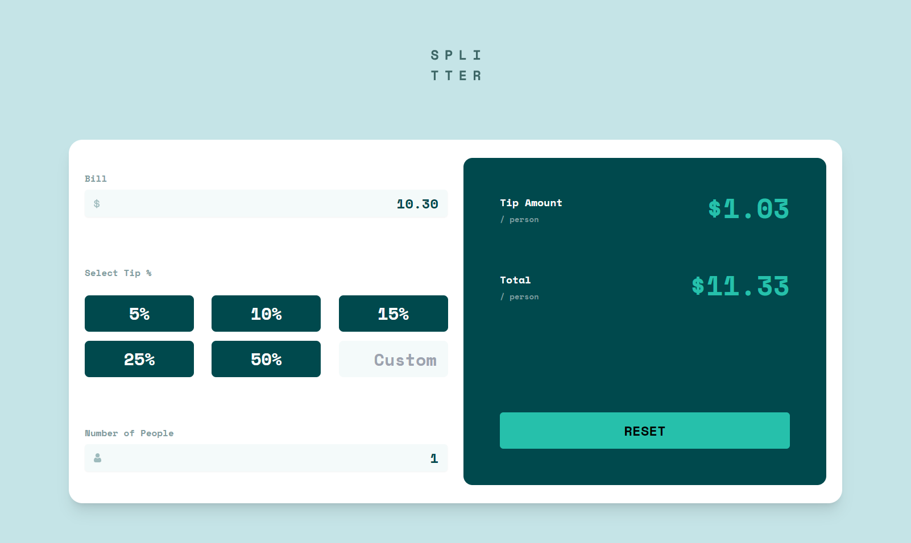
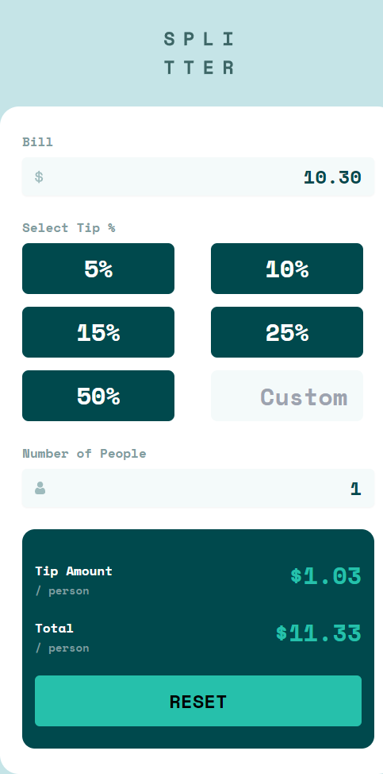

# Frontend Mentor - Tip calculator app solution

This is a solution to the [Tip calculator app challenge on Frontend Mentor](https://www.frontendmentor.io/challenges/tip-calculator-app-ugJNGbJUX). Frontend Mentor challenges help you improve your coding skills by building realistic projects.

## Table of contents

- [Frontend Mentor - Tip calculator app solution](#frontend-mentor---tip-calculator-app-solution)
  - [Table of contents](#table-of-contents)
  - [Overview](#overview)
    - [The challenge](#the-challenge)
    - [Screenshot](#screenshot)
      - [Desktop](#desktop)
      - [Mobile](#mobile)
    - [Links](#links)
    - [Built with](#built-with)
    - [What I learned](#what-i-learned)
    - [Useful resources](#useful-resources)
  - [Author](#author)

## Overview

### The challenge

Users should be able to:

- View the optimal layout for the app depending on their device's screen size
- See hover states for all interactive elements on the page
- Calculate the correct tip and total cost of the bill per person

### Screenshot

#### Desktop

#### Mobile

### Links

- Solution URL: [Will update once submitted on frontend mentor](https://your-solution-url.com)
- Live Site URL: [Site deployed on Vercel](https://tip-calc-opal.vercel.app/))

### Built with

- Semantic HTML5 markup
- Flexbox
- CSS Grid
- Mobile-first workflow
- [React](https://reactjs.org/) - JS library
- [Tailwind](https://tailwindcss.com/) - For CSS & Styling

**Note: These are just examples. Delete this note and replace the list above with your own choices**

### What I learned

This was my first time really diving into using Tailwind - I really enjoyed how intuitive Tailwind becomes after some time playing around with it as well as the out of the box design system in place that's fun to leverage.

### Useful resources

- [Tailwind Docs](https://tailwindcss.com/docs/installation) - I was constantly refferring to the Tailwind Docs throughout the entire process - the quick search (CTRL + K) was crucial in quickly finding the exact utlity class I needed for a perticular scenario.

## Author

- Github - [zayaanw](https://github.com/zayaanw)
- Frontend Mentor - [@zayaanw](https://www.frontendmentor.io/profile/zayaanw)
